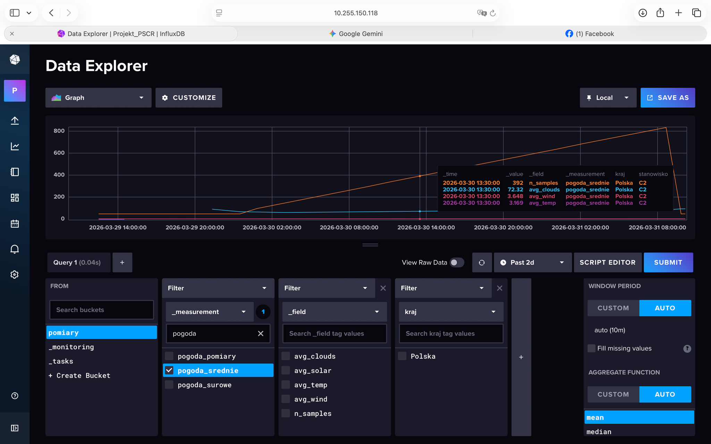
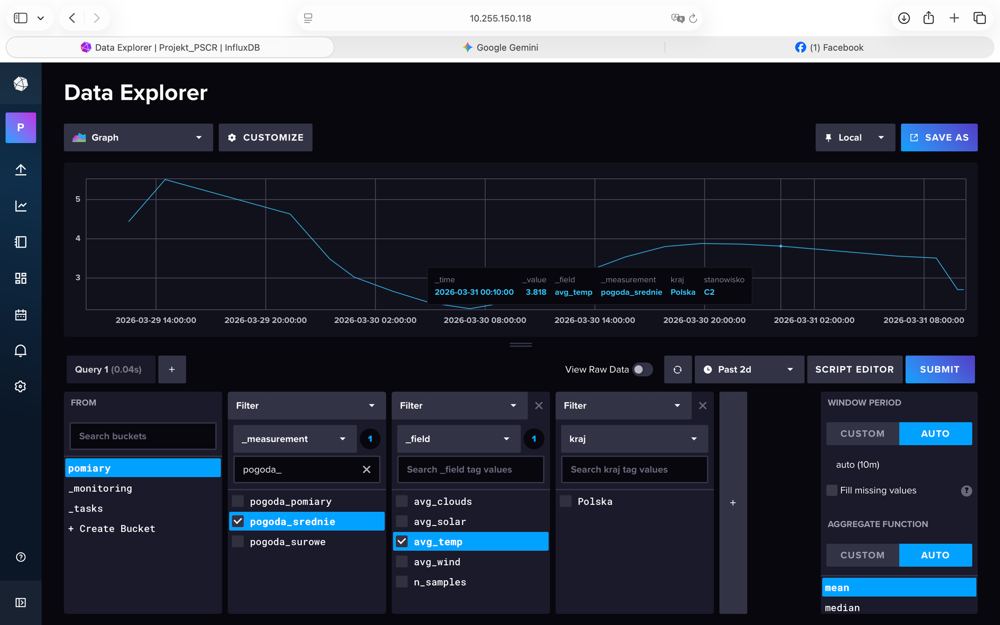
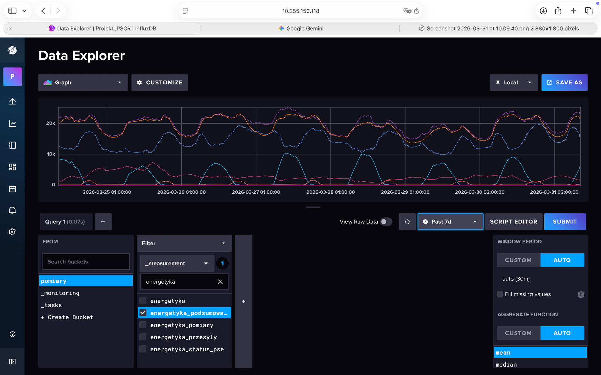
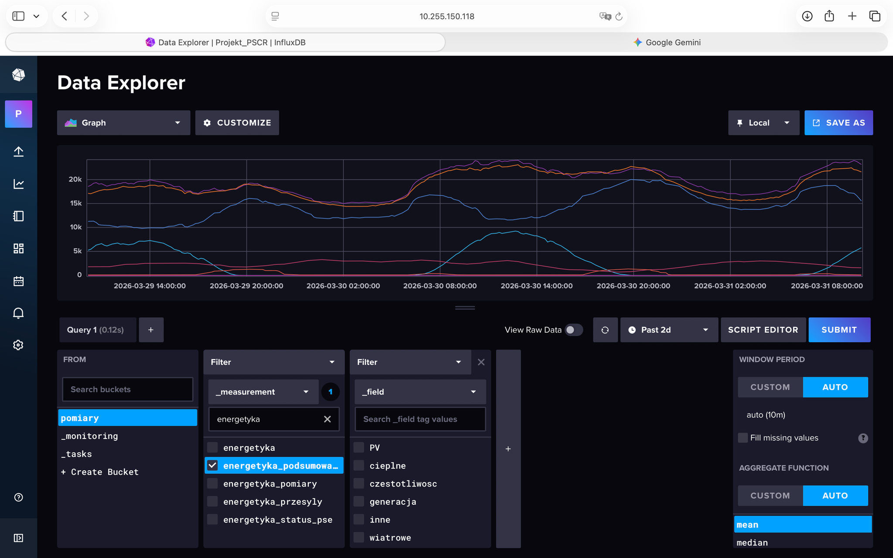
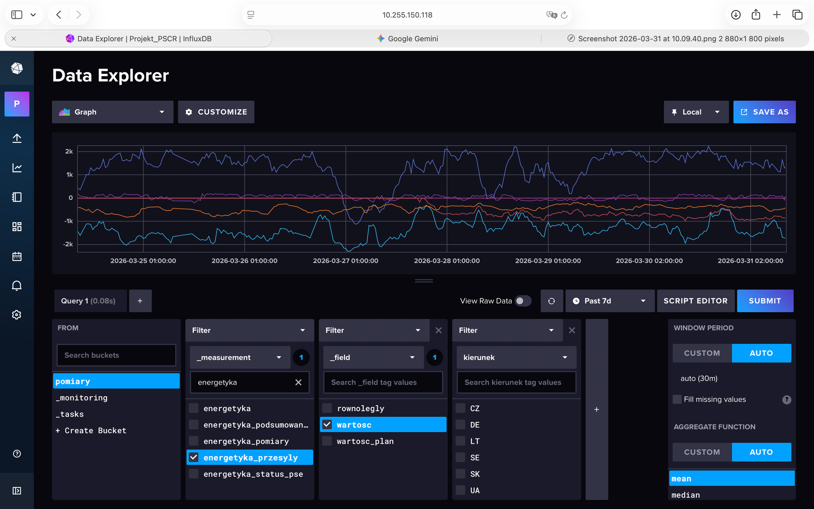
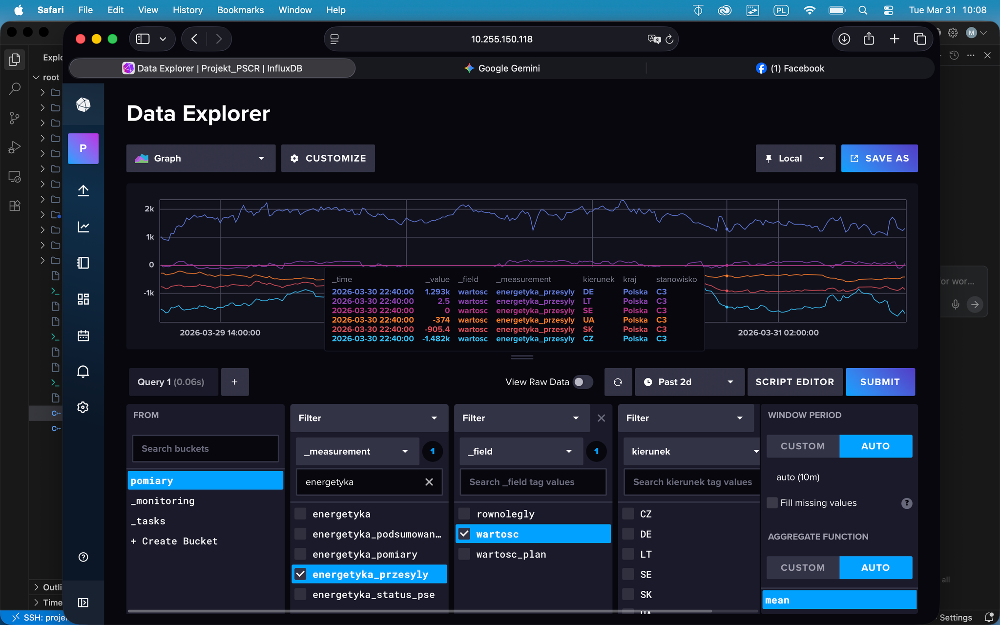

# Wyniki — dane zebrane przez C4

Poniższe zrzuty ekranu pochodzą z InfluxDB Data Explorer (VPS `10.255.150.118`).
System pracował nieprzerwanie przez **ponad 7 dni** (widoczny zakres ~26–31 marca 2026).

## Dane pogodowe — stanowisko C2

Dane napływają z pomiarów pogodowych dla siatki stacji w Polsce.
Measurement `pogoda_srednie` zawiera wartości uśrednione przez C2:
`avg_temp`, `avg_wind`, `avg_solar`, `avg_clouds`, `n_samples`.

### Wszystkie średnie — 2 dni

Widoczny komplet pól: temperatura, wiatr, nasłonecznienie, zachmurzenie oraz liczba próbek użyta do uśrednienia. Wszystkie serie ciągłe — brak przerw w odbiorze z C2.

### Temperatura uśredniona — 2 dni

Pole `avg_temp` (°C) dla tagu `kraj=Polska`. Widoczny wyraźny dobowy cykl temperatury z maksimum w porze południowej.

---

## Dane energetyczne — stanowisko C3

Dane pobierane przez C3 z `pse.pl`. Measurement `energetyka_podsumowanie` grupuje
parametry sieci KSE: moc zapotrzebowania, generację wg źródeł i częstotliwość.
Measurement `energetyka_przesyly` rejestruje wymianę transgraniczną z tagiem `kierunek`.

### Podsumowanie KSE — przegląd 7 dni

Widok ogólny wszystkich serii z `energetyka_podsumowanie` za tydzień.
Widoczny regularny rytm dobowy zapotrzebowania i generacji.

### Generacja wg źródeł — 2 dni

Pola: `PV` (fotowoltaika), `cieplne`, `generacja` (łączna), `inne`, `slatowe` (słoneczne łącznie) oraz `czestotliwosc` sieci (50 Hz ± odchylenia).
Widoczny wyraźny szczyt PV w godzinach dziennych.

### Przesyły transgraniczne — 7 dni

Measurement `energetyka_przesyly`, filtr `kierunek` ∈ {CZ, DE, LT, SE, SK, UA}.
Pola `wartosclac` i `wartosclac_plan` — realizacja i plan wymiany w MW.
Widoczna dominacja kierunku DE i CZ.

### Przesyły — wartości zrealizowane vs plan — 2 dni

Zbliżenie na 2 dni dla pola `wartosclac` (zrealizowana wymiana, MW).
Seria dla kierunku `CZ` i `Polska` (eksport netto) — widoczna korelacja z dobowym profilem zapotrzebowania.

---

## Podsumowanie

| Measurement | Rekordy | Zakres |
|---|---|---|
| `pogoda_srednie` | ciągły, co ~60 s | 26–31 marca 2026 |
| `pogoda_pomiary` | surowe pomiary per stacja | 26–31 marca 2026 |
| `energetyka_podsumowanie` | co ~5 min | 26–31 marca 2026 |
| `energetyka_przesyly` | co ~5 min, per kraj | 26–31 marca 2026 |
| `energetyka_status_pse` | co ~5 min | 26–31 marca 2026 |

Brak widocznych dziur w danych — aplikacja C4 utrzymywała ciągłość
pomimo rotacji połączeń MQTT i restartów na VPS.
